# aws-vpc

English | [简体中文](README_zh.md)

> This repository demonstrates how to use Terraform to build a VPC and deploy EKS and ElastiCache using modules.

## Features

- Automatically create a VPC network across multiple Availability Zones
- Public subnet configuration included
- Automatic Internet Gateway configuration
- Pre-configured security groups supporting SSH and HTTP access
- Based on Ubuntu 24.04 LTS AMI
- Fully configurable network CIDR and subnet allocation
- High-availability Redis cluster using ElastiCache
  - Deployed in private subnets for enhanced security
  - Multi-node deployment across availability zones

## Architecture Graph

```mermaid
graph TD
    %% 1. 样式定义
    classDef vpc fill:#f9f9f9,stroke:#333,stroke-width:2px
    classDef az fill:#e6f3ff,stroke:#337ab7,stroke-width:1px
    classDef public fill:#dff0d8,stroke:#3c763d,stroke-width:1px
    classDef private fill:#f2dede,stroke:#a94442,stroke-width:1px
    classDef control_plane fill:#fffde7,stroke:#fbc02d,stroke-width:1px

    %% 2. 元素结构
    subgraph "Management Plane"
        direction LR
        console["<font size=5>👨‍💻</font><br/>Admin/Console"]
        subgraph "AWS Managed Services"
            direction TB
            eks_cp["EKS Control Plane"]
            ec_cp["ElastiCache Control Plane"]
        end
    end

    subgraph VPC
        direction LR
        igw["Internet<br/>Gateway"]
        subgraph az1 ["Availability Zone 1"]
            direction TB
            subgraph pub1 [Public Subnet 1]
                nat["NAT Gateway"]
            end
            subgraph priv1 [Private Subnet 1]
                eks1(("EKS Node 1"))
                ec1(("ElastiCache Node 1"))
            end
        end
        subgraph az2 ["Availability Zone 2"]
            direction TB
            subgraph pub2 [Public Subnet 2]
                spacer1( )
            end
            subgraph priv2 [Private Subnet 2]
                eks2(("EKS Node 2"))
                ec2(("ElastiCache Node 2"))
            end
        end
        subgraph az3 ["Availability Zone 3"]
            direction TB
            subgraph pub3 [Public Subnet 3]
                spacer2( )
            end
            subgraph priv3 [Private Subnet 3]
                eks3(("EKS Node 3"))
                ec3(("ElastiCache Node 3"))
            end
        end
    end
    
    %% 3. 应用样式到元素
    class eks_cp,ec_cp control_plane
    class VPC vpc
    class az1,az2,az3 az
    class pub1,pub2,pub3 public
    class priv1,priv2,priv3 private
    style spacer1 fill:#0000,stroke:#0000
    style spacer2 fill:#0000,stroke:#0000
    
    %% 4. 连接关系
    priv1 & priv2 & priv3 -- "EIP" --> nat
    nat --> igw
    console --> eks_cp & ec_cp
    
    eks_cp -- "Manages" --> eks1
    eks_cp -- "Manages" --> eks2
    eks_cp -- "Manages" --> eks3

    ec_cp -- "Manages" --> ec1
    ec_cp -- "Manages" --> ec2
    ec_cp -- "Manages" --> ec3

    %% 5. 应用样式到连接线 (根据上面的顺序)
    linkStyle 6 stroke:#007bff,stroke-width:2px,stroke-dasharray:5 5
    linkStyle 7 stroke:#007bff,stroke-width:2px,stroke-dasharray:5 5
    linkStyle 8 stroke:#007bff,stroke-width:2px,stroke-dasharray:5 5
    linkStyle 9 stroke:#28a745,stroke-width:2px,stroke-dasharray:5 5
    linkStyle 10 stroke:#28a745,stroke-width:2px,stroke-dasharray:5 5
    linkStyle 11 stroke:#28a745,stroke-width:2px,stroke-dasharray:5 5
```



## Architecture Decisions

### NAT Gateway Configuration

The project deliberately deploys a single NAT Gateway in the first public subnet as a balanced approach between:

- **High Availability**: While multiple NAT Gateways (one per AZ) would provide the highest availability, a single NAT Gateway still serves all private subnets effectively.
- **Cost Optimization**: NAT Gateway pricing includes both hourly charges and data processing fees. Using a single NAT Gateway significantly reduces operational costs while maintaining adequate functionality for most use cases.

This design is suitable for non-critical workloads and development environments. For production environments with strict high-availability requirements, consider deploying additional NAT Gateways.

## Quick Start

1. Configure AWS credentials
2. Modify variables in `variables.tf` (optional)
3. Run the following commands:

```bash
terraform init
terraform plan
terraform apply
```

## Main Variables

- `vpc_cidr_block`: VPC CIDR block (default: "10.0.0.0/16")
- `project_prefix`: Resource name prefix
- `enable_availability_zone_num`: Number of Availability Zones to enable (determines Redis cluster size)
- `instance_type`: EC2 instance type
- `public_subnet_offset`: Offset for public subnet CIDR blocks (default: 0, e.g., 10.0.0.0/24, 10.0.1.0/24)
- `private_subnet_offset`: Offset for private subnet CIDR blocks (default: 10, e.g., 10.0.10.0/24, 10.0.11.0/24)
